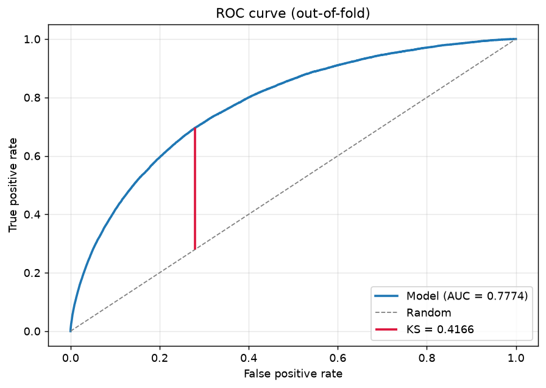
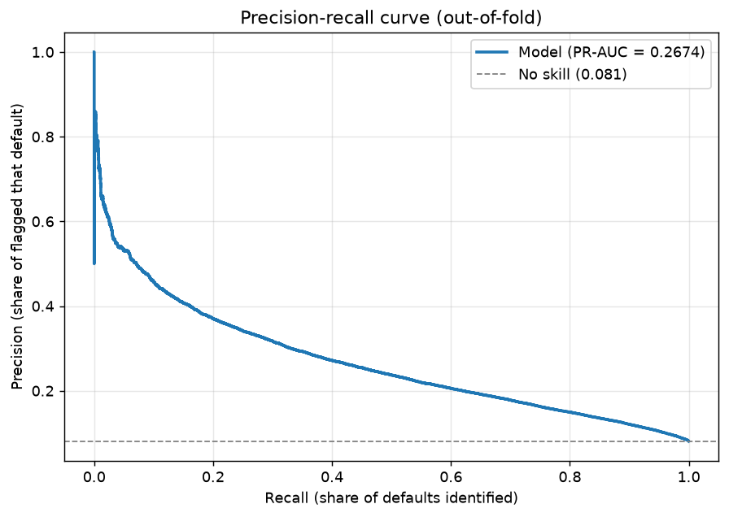
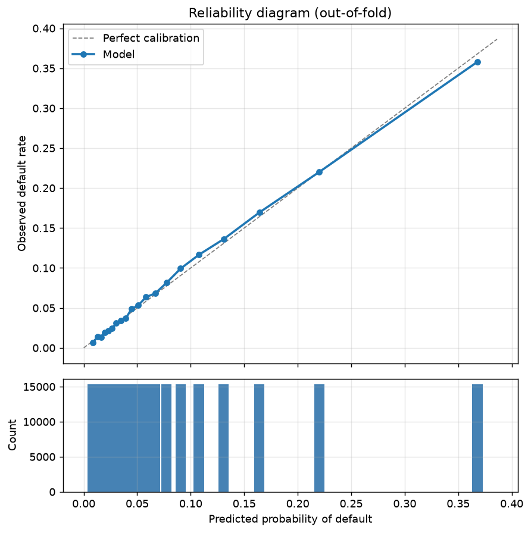
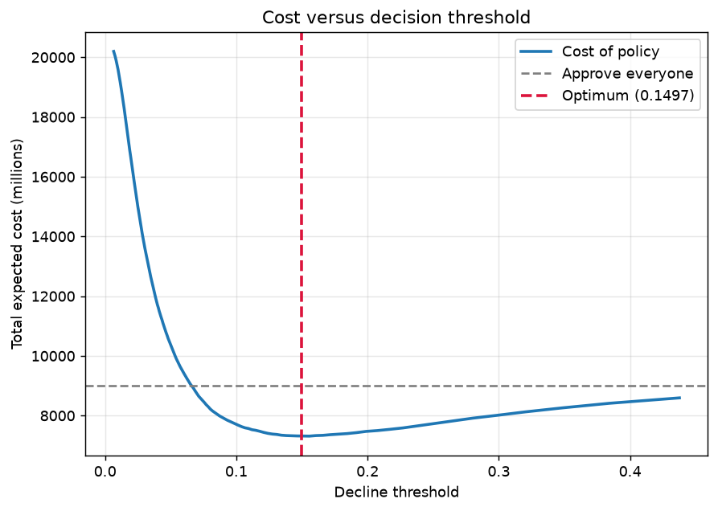

# Credit Default Risk

An end-to-end credit risk model on the [Home Credit Default Risk](https://www.kaggle.com/competitions/home-credit-default-risk)
dataset: 307,511 loan applications across seven relational tables, with an 8.1%
default rate.

The goal is not a leaderboard score. It is a model whose output a lender could
actually act on — calibrated probabilities, a decision threshold derived from
the cost of being wrong, and an audit trail explaining why any given applicant
was declined.

> Every number below was produced by code in this repository and can be
> regenerated with `make features && make train && make evaluate`. The raw
> outputs are tracked in [`reports/metrics.json`](reports/metrics.json) and
> [`models/cv_metrics.json`](models/cv_metrics.json).

---

## The problem

A lender approving a loan makes two kinds of mistake, and they do not cost the
same amount:

| | Applicant repays | Applicant defaults |
|---|---|---|
| **Approve** | Earn the margin | Lose ~65% of principal |
| **Decline** | Forgo the margin | Cost avoided |

Because loss given default is several times the profit margin, false negatives
are far more expensive than false positives. That asymmetry, not a default
`0.5` cutoff, is what determines where the approve/decline line should sit —
and it is the difference between a classifier and a lending policy.

## Why this dataset is harder than it looks

**Severe class imbalance.** At an 8.1% default rate, predicting "nobody
defaults" scores 91.9% accuracy. Accuracy is not reported anywhere in this
project; discrimination is measured with ROC-AUC, Gini, PR-AUC and the KS
statistic.

**The signal lives in the child tables.** Six of the seven tables are one-to-many
against the application: bureau records, previous applications, monthly
instalments. Collapsing them onto one row per applicant without leaking
information is most of the modelling work.

**Sentinel values that are not NaN.** `DAYS_EMPLOYED` encodes "not employed" as
`365243` — a thousand years. Pandas reads it as a valid integer. Left alone it
silently corrupts every split that touches the column. See
[`features/application.py`](src/credit_risk/features/application.py).

**Probabilities have to be right, not just ordered.** An expected-loss
calculation needs a predicted 3% to mean an actual 3%. A model can rank
perfectly and still be badly calibrated, so calibration is measured explicitly
(Brier score, expected calibration error) rather than assumed.

## Approach

1. **Clean** — sentinel decoding, impossible-value handling, with a flag
   recorded before each value is nulled so the missingness itself stays
   available to the model.
2. **Engineer** — affordability ratios a credit analyst would compute by hand
   (`AMT_CREDIT / AMT_INCOME_TOTAL`, implied loan term, debt-to-credit), which
   trees cannot construct for themselves; plus relational aggregates over the
   bureau tables.
3. **Train** — LightGBM, 5-fold stratified cross-validation, early stopping on
   each fold, producing out-of-fold predictions for every training row.
4. **Decide** — convert probabilities to an approve/decline policy by
   minimising expected cost, with a sensitivity analysis across the business
   assumptions so the headline number does not rest on one guessed constant.

Class weighting is deliberately **not** used. Reweighting the positive class
does nothing for a ranking metric and destroys the calibration this project
depends on. Imbalance is handled at the decision layer instead — see
[`configs/model.yaml`](configs/model.yaml).

## Results

5-fold stratified cross-validation on 307,507 applications, 223 features.
All figures are out-of-fold.

| Metric | Value | Reading |
|---|---|---|
| **ROC-AUC** | **0.7774** ± 0.0041 | Competition winners reached ~0.805 using all seven tables and large ensembles |
| **Gini** | **0.5548** | Above the ~0.5 that is considered a strong application scorecard |
| **PR-AUC** | **0.2674** | 3.3× the 0.0807 no-skill floor |
| **KS statistic** | **0.4166** | Comfortably inside the 0.4–0.5 band expected of a production scorecard |
| **Brier score** | 0.0666 | |
| **ECE** | **0.0031** | Predictions are off by ~0.3 percentage points on average |
| **Lift at 10%** | **3.58×** | The riskiest decile defaults at 3.6× the portfolio rate |

Fold AUCs: 0.7728, 0.7833, 0.7756, 0.7813, 0.7743.

### The decision policy

Minimising expected cost puts the decline threshold at **0.1497**, not 0.5:

| | Approve everyone | Cost-optimal policy |
|---|---|---|
| Approval rate | 100% | 85.7% |
| Default rate on the approved book | 8.07% | **5.18%** |
| Defaults avoided | — | 45.1% |
| Good customers turned away | — | 11.6% |
| **Expected loss** | baseline | **−18.8%** |

The model identifies **45% of all defaults** while declining only **14% of
applicants**, cutting the bad rate on the approved book by roughly a third.

Under the central assumptions (LGD 0.65, margin 0.12) that is a **18.8%**
reduction in expected loss. Across the full 5×5 sensitivity grid the saving
stays positive in **25 of 25** combinations, ranging from 4.7% to 37.0% — so
the conclusion is a property of the model, not of the assumed constants. See
[`reports/sensitivity.csv`](reports/sensitivity.csv).

### Figures

| | |
|---|---|
|  |  |
|  |  |

The reliability diagram tracks the diagonal closely, which is what licenses
the expected-loss calculation: a predicted 10% really does default about 10%
of the time. The cost curve shows how far the optimum sits from the naive 0.5
cutoff — at 0.5 the model declines almost nobody and saves almost nothing.

### What the model leans on

`EXT_SOURCE_MEAN` — the average of three external bureau scores — dominates by
gain, followed by `ORGANIZATION_TYPE` and `CREDIT_TERM` (the implied loan term,
an engineered ratio). Of the top 20 features, 8 are engineered rather than raw.

This is worth stating plainly: a large share of the model's power comes from
other institutions' credit scores. A lender without access to those would see
materially worse performance, and any assessment of this model has to account
for that dependency. Full ranking in
[`models/feature_importance.csv`](models/feature_importance.csv).

## Project structure

```
src/credit_risk/
├── config.py            paths, conventions, business assumptions
├── data/
│   ├── download.py      Kaggle acquisition
│   └── load.py          dtype-optimised loading with a Parquet cache
├── features/
│   ├── application.py   cleaning + affordability/tenure ratios
│   ├── aggregation.py   reusable one-to-many collapse helpers
│   ├── bureau.py        external credit history aggregates
│   └── build.py         assembles the modelling table
├── models/
│   └── train.py         stratified CV, OOF predictions, artefacts
└── evaluation/
    ├── metrics.py       AUC, Gini, PR-AUC, KS, Brier, ECE, lift
    └── business.py      expected cost, threshold search, sensitivity
```

## Reproducing

```bash
make setup      # create .venv and install
make data       # download from Kaggle (~690 MB; needs API credentials)
make features   # build the modelling table
make train      # 5-fold cross-validation
make evaluate   # metrics, figures, threshold analysis
```

`make data` needs Kaggle credentials and acceptance of the competition rules.
The simplest route is `python -m kaggle auth login`, which caches credentials
via OAuth with no token to manage; a token in `~/.kaggle/access_token`, the
`KAGGLE_API_TOKEN` environment variable, or a legacy `~/.kaggle/kaggle.json`
all work too. Everything else runs offline.

On macOS, LightGBM additionally needs the OpenMP runtime: `brew install libomp`.

## Tests

```bash
make test
make lint
```

The suite runs on synthetic fixtures only, so it needs no dataset and runs in
CI on every push. The tests that matter most are the data-quality ones — a
sentinel value or an infinity leaking into the feature matrix raises no error,
it just quietly degrades the model.

## Roadmap

- [x] Application-level cleaning and feature engineering
- [x] Bureau relational aggregates
- [x] Cross-validated LightGBM baseline
- [x] Imbalance-aware and calibration metrics
- [x] Cost-based threshold optimisation
- [ ] `previous_application`, `installments_payments`, `credit_card_balance` aggregates
- [x] Reliability diagnostics (ECE 0.0031 — recalibration not currently warranted)
- [ ] SHAP-based global and per-applicant explanations
- [ ] Fairness audit across age and gender slices
- [ ] Hyperparameter search with Optuna
- [ ] FastAPI scoring service + Docker image
- [ ] Model card and methodology write-up

## Data

Home Credit Default Risk, released by Home Credit Group for a 2018 Kaggle
competition. Redistribution is not permitted, so the repository contains the
code that reproduces the dataset rather than the data itself.

## Licence

MIT
